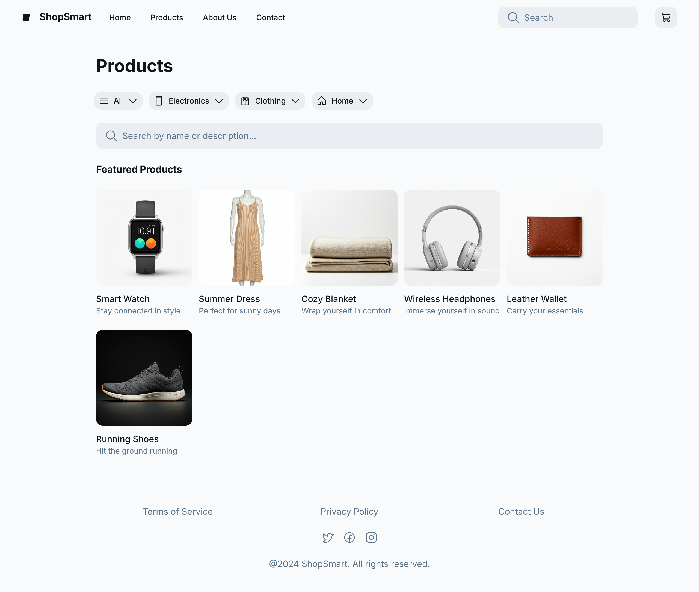
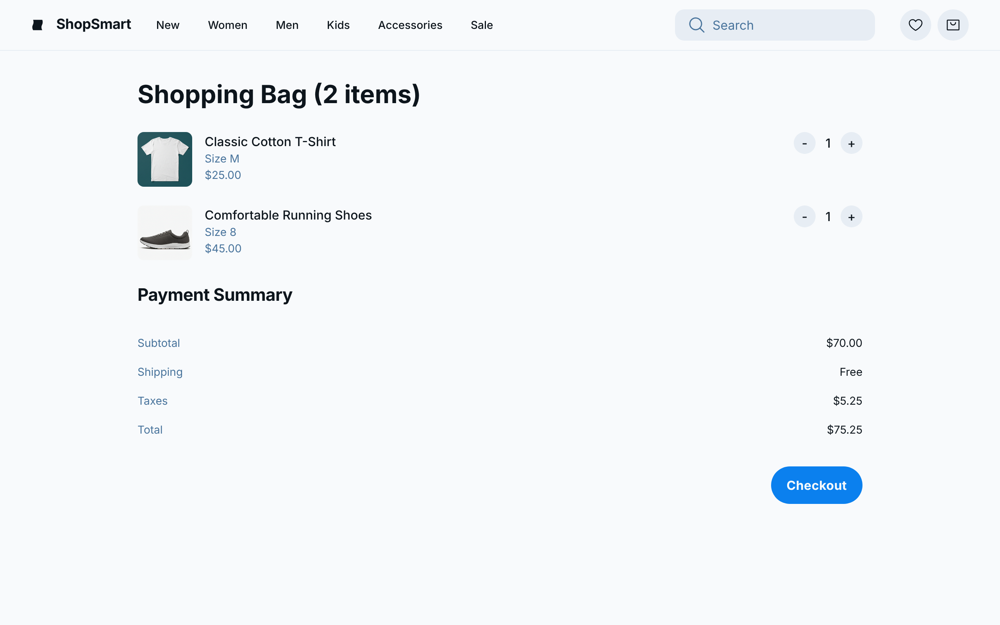
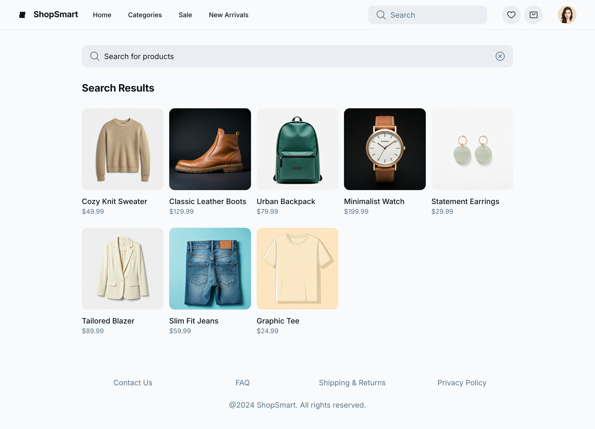

# 🛒 ShopSmart - Aplicación Web de E-commerce

<p align="center"> 
   
</p>

<p align="center"> 
  
  
  
  
</p>

---

## 📝 Descripción del Proyecto

ShopSmart es una aplicación web de e-commerce moderna, responsive y construida con HTML5, CSS3 y JavaScript vanilla. Ofrece una experiencia de compra fluida con navegación de productos, filtrado, gestión del carrito y (en la versión avanzada) un sistema de pago simulado. Diseñada para claridad, usabilidad y compatibilidad móvil, ShopSmart es ideal para aprendizaje, prototipado o como base para tiendas online reales.

### ✨ Características Principales

- **🛍️ Catálogo de Productos**: Navegar, filtrar y ordenar productos
- **🛒 Carrito de Compras**: Agregar, eliminar y actualizar elementos con almacenamiento persistente
- **🔎 Filtros y Ordenamiento**: Por categoría, precio y búsqueda
- **💳 Simulación de Pago**: (Versión avanzada) Checkout con formulario de pago
- **📱 Diseño Responsive**: Optimizado para todos los dispositivos, con navegación móvil
- **🔔 Retroalimentación del Usuario**: Mensajes toast para acciones y errores
- **🌙 UI Moderna**: Limpia, accesible y visualmente atractiva

---

## 🚀 Características Implementadas

### Características Básicas
- ✅ Listado de productos con imágenes, precio y detalles
- ✅ Agregar/eliminar/actualizar elementos del carrito
- ✅ Persistencia del carrito (localStorage)
- ✅ Filtrado y ordenamiento de productos
- ✅ Menú de navegación móvil responsive
- ✅ Notificaciones toast para acciones del usuario

### Características Avanzadas (index2.html + main.js)
- **💳 Sistema de Pago**: Checkout simulado con validación de formularios
- **🧾 Resumen de Pedido**: Revisar antes de confirmar la compra
- **🔒 Validación de Entrada**: Previene datos inválidos en el checkout

---

## 🔧 Tecnologías Utilizadas

### Frontend
- **HTML5**: Marcado semántico y accesible
- **CSS3**: 
  - Layout responsive con Flexbox y media queries
  - UI moderna con transiciones y efectos
  - Hoja de estilos compartida para todas las versiones
- **JavaScript (ES6+)**:
  - Código modular y orientado a eventos
  - Lógica de carrito y productos
  - Manipulación del DOM y localStorage

### Herramientas de Desarrollo
- **Git & GitHub**: Control de versiones
- **VSCode**: Editor recomendado

---

## 🗂️ Estructura del Proyecto

```
Proyect javascript/
│
├── index2.html         # Aplicación principal con sistema de pago
├── main.js             # Lógica JS para versión avanzada
├── index-simple.html   # Versión simple (sin pago)
├── main-simple.js      # Lógica JS para versión simple
├── style.css           # Estilos compartidos
├── README.md           # Documentación principal
├── README-VERSIONS.md  # Comparación de versiones
├── QUICK-START.md      # Guía de uso rápido
├── analisis.md         # Análisis de diseño y técnico
├── wireframes.md       # Wireframes y flujos de usuario
└── ...                 # Otros documentos
```

---

## 🎮 Cómo Usar la Aplicación

### Inicio Rápido
1. Abre `index-simple.html` para la tienda básica (sin pago)
2. Abre `index2.html` para la tienda completa con simulación de pago
3. Navega por productos, agrega al carrito y (en versión avanzada) finaliza la compra

Ver [QUICK-START.md](./docs/QUICK-START.md) para pasos detallados.

---

## 🎨 Diseño y UX

### Paleta de Colores
- **Primario**: #4F8EF7 (Azul)
- **Acento**: #F7C948 (Amarillo)
- **Fondo**: #f9f9f9 (Claro) / #222 (Elementos oscuros)

### Características de Diseño
- **🧩 Layout Limpio**: Enfoque en usabilidad y claridad
- **📱 Mobile-First**: Menú hamburguesa, controles táctiles
- **🔔 Retroalimentación**: Toasts para acciones/errores
- **♿ Accesibilidad**: Buen contraste, navegación por teclado

---

## 📐 Maquetación Inicial

### 🎨 Proceso de Diseño

La maquetación inicial de ShopSmart se desarrolló siguiendo un proceso iterativo que incluyó bocetos, wireframes y mockups. Estas imágenes documentan la evolución del diseño desde el concepto inicial hasta la implementación final. ✨

### 📸 Imágenes de Maquetación

<div align="center">

#### 🏠 Boceto de la Página Principal

*Boceto inicial que muestra la estructura de la página principal con navegación, filtros y cuadrícula de productos*

#### 🛒 Wireframe del Carrito

*Wireframe del carrito lateral que muestra la disposición de productos, controles de cantidad y total*

#### 💳 Mockup del Checkout

*Mockup del proceso de checkout con formulario de pago y resumen del pedido*

</div>

### 📋 Decisiones de Diseño

- **Layout Responsive**: Diseño mobile-first que se adapta a diferentes tamaños de pantalla
- **Navegación Intuitiva**: Menú hamburguesa para móviles, navegación horizontal para desktop
- **Carrito Lateral**: Acceso rápido sin perder el contexto de navegación
- **Proceso de Pago Simplificado**: Formulario claro y validación en tiempo real

> 💡 **Nota**: Las imágenes de maquetación se encuentran en la carpeta [`images/`](./images/) junto con documentación adicional sobre el proceso de diseño.

---

## 💻 Arquitectura del Código

### Estructura Principal
```javascript
// Ejemplo: Lógica del carrito (main.js)
const cart = JSON.parse(localStorage.getItem('cart')) || [];

function addToCart(product) {
  // Agregar producto, actualizar localStorage, mostrar toast
}

function renderCart() {
  // Actualizar UI del carrito
}

// ... más funciones modulares para filtrado, ordenamiento, pago, etc.
```

### Características del Código
- **🔧 Modular**: Funciones para carrito, filtros, UI, pago
- **🛡️ Robusto**: Maneja casos extremos y errores
- **⚡ Eficiente**: Mínimas actualizaciones del DOM
- **📖 Legible**: Bien comentado, nombres claros
- **🔄 Mantenible**: Fácil de extender (agregar productos, características)

---

## 🧪 CÓDIGO DESTACADO

### Ejemplo CSS Moderno
```css
:root {
  --primary: #4F8EF7;
  --accent: #F7C948;
  --bg: #f9f9f9;
  --text: #222;
  --transition: all 0.2s ease;
}

.button-primary {
  background: var(--primary);
  color: #fff;
  transition: var(--transition);
}
```

### JavaScript: Notificación Toast
```javascript
function showToast(message, type = 'success') {
  const toast = document.createElement('div');
  toast.className = `toast toast-${type}`;
  toast.textContent = message;
  document.body.appendChild(toast);
  setTimeout(() => toast.remove(), 2500);
}
```

---

## 💬 Conclusión

ShopSmart demuestra cómo construir un sitio de e-commerce moderno y fácil de usar usando solo HTML, CSS y JavaScript. Equilibra simplicidad y funcionalidad, convirtiéndolo en una excelente base para aprendizaje o desarrollo posterior.

### Logros Técnicos
- ✅ **UI Moderna**: Limpia, responsive y accesible
- ✅ **Persistencia del Carrito**: Datos guardados en el navegador
- ✅ **Retroalimentación del Usuario**: Toasts y manejo de errores
- ✅ **Versionado**: Dos modos para diferentes necesidades

---

## 📄 Licencia

Este proyecto está licenciado bajo la Licencia MIT - ver el archivo [LICENSE](LICENSE) para detalles.

---

<p align="center">
  Developed with ❤️ by DanielSantiagoVinascoamamuchoamp<br>
  🔥 <b><a href="https://github.com/DanielSantiagoV">Visit my GitHub</a></b> 🚀
</p>
  📦 <b>Proyecto E-commerce ShopSmart</b> 🛒
</p> 

